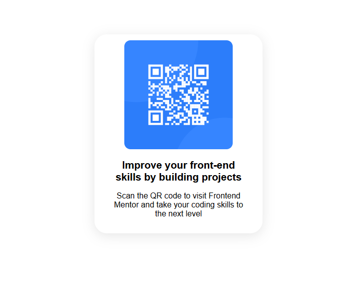

# Frontend Mentor - QR code component solution

This is a solution to the [QR code component challenge on Frontend Mentor](https://www.frontendmentor.io/challenges/qr-code-component-iux_sIO_H). Frontend Mentor challenges help you improve your coding skills by building realistic projects. 

## Table of contents

- [Overview](#overview)
  - [Screenshot](#screenshot)
- [My process](#my-process)
  - [Built with](#built-with)
  - [What I learned](#what-i-learned)

**Note: Delete this note and update the table of contents based on what sections you keep.**

## Overview
In this repo I implemented my solution to the QR challenge from the page ftonendMentors. I tried it to do as good as possible with the little knowledge I have so far ;-)
### Screenshot

## My process
Basically I had a look at the design to see how it should look like and started with the easier parts to add the image and format the text the right way. After that I researched how the css style was done and then I tried to reproduce as good as I could. Since my knowledge with HTML and css are not very deep, I had to research quite a while, especially for the right tags an styles to use. 
### Built with

- HTML
- inline CSS

### What I learned

I learned that I need to learn some more CSS styles because a lot of the time I took for implementing was try and error to see what needs to be adjusted and to find out the right value for it. Also I had a short look on how to make a side responsive for smaller screens. While my solution might not be perfect, I hope it is the first step in the right direction.

